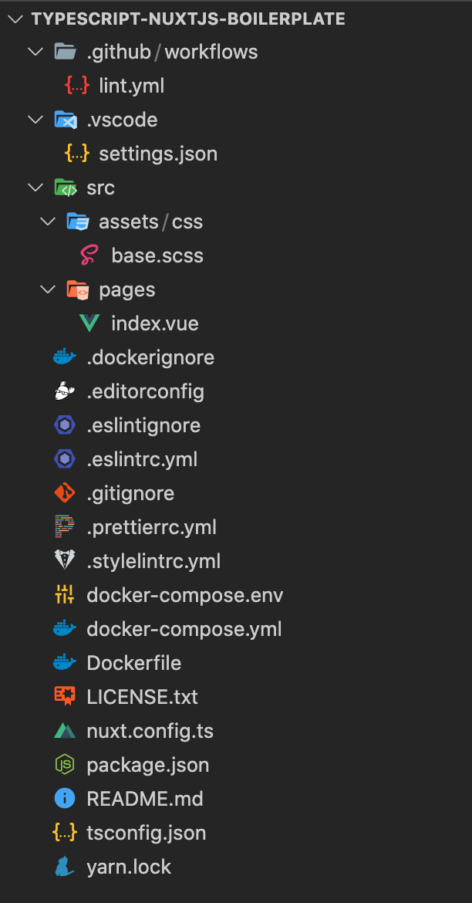

# 概要

https://docs.google.com/document/d/19fndV_3c6a0pI5oxiVVmPlqCE-IWM8xBbqL7IzKy2Y8/edit#heading=h.y9ws57j6oe98

↑のチュートリアルで説明されていない部分を補足するような形のメモにできればと。。。

# 各ファイル解説

<!--  -->


- github/lint.yml

- vscode/setting.json  
ファイルのコメントに書いてある通りなので省略

- src  
Nuxtjsの作業ディレクトリ(tsconfigのコンパイル対象)  
[NuxtJs - DIRECTORY STRUCTURE](https://nuxtjs.org/docs/2.x/directory-structure/nuxt)

- .dockerignore  
dockerで無視するファイルを指定するもの  

- docker-compose.env  
- docker-compose.yml  
- Dockerfile  

- .editorconfig  
異なるエディター間でコードスタイルを統一するためのもの  
https://editorconfig.org/  
https://qiita.com/inabe49/items/d81fed3cf58ad751d915   

- .eslintrc.yml   
Eslintはjsのlintツール、その設定ファイル  
[https://qiita.com/mysticatea/items/f523dab04a25f617c87d](https://qiita.com/mysticatea/items/f523dab04a25f617c87d)  
[https://qiita.com/howdy39/items/6e2c75861bc5a14b2acf](https://qiita.com/howdy39/items/6e2c75861bc5a14b2acf)  

- .gitignore  
馴染みのあれ  
githubに公式(?)のテンプレートが載っている  
https://github.com/github/gitignore/blob/master/Node.gitignore  
余談だがmacならgiboというhomebrewで入れられるパッケージで用意できるっぽい  
https://qiita.com/taquaki-satwo/items/358d2d473fff9a25d5eb  

- .prettierrc.yml  
eslintと同じlint系ツール  
そのままだと競合するので、.eslintrcにそれを避ける設定を書くなどする  
[https://qiita.com/yokori/items/57875c186ea3ee312d8c](https://qiita.com/yokori/items/57875c186ea3ee312d8c)  
    ```yaml
    extends:
        - "@nuxtjs/eslint-config-typescript"
        - plugin:prettier/recommended
        - prettier/@typescript-eslint
    ```

- .stylelintrc.yml   
stylelintrcはCSSのlinter  
Prettierと違ってデフォルトだと何も設定されていないため、好きに追加していく形になる  
ルールを一個ずつ追加するのは大変なので`stylelint-config-*`で始まるパッケージを継承して使うのが基本(以下の部分)
    ```yaml
    extends:
    - stylelint-config-standard
    ```
    またscssを使う場合は記述が必要
    ```yaml
    plugins:
    - stylelint-scss
    ```
    これらに加えて細かいルールを付けたりたりしていく
    ```yaml
    rules:
    string-quotes: single
    ....
    ```
    [stylelintの設定ファイルの作り方](https://qiita.com/morishitter/items/fefa1de3137036c7d9c6)  
    https://qiita.com/DesignChips/items/cd5282dba553026757c8  
    https://trs.mn/blog/2020/04/23/vscode-eslint-stylelint/  


- tsconfig.json  
→ [typescript解説](./typescript.md)


[](%E3%83%95%E3%82%A1%E3%82%A4%E3%83%AB%E8%A7%A3%E8%AA%AC%209631ec66b3be44d0952abf4959ecc472/Untitled%208c7240169a45429c97b9db1d854c7184.md)

- yarn.lock  
パッケージを指定するやつ  
yarn init したあとに任意のパッケージをyarn addすると自動的に作られる  
[npm,yarnのlockファイルの恩恵 - Qiita](https://qiita.com/youdays/items/9a98e43391414ec939e6)
    > 昔のnpmはpackage.jsonしかなかったです。yarnはyarn.lockを作りました。これによってパッケージの依存関係がより厳密になりました。でもその後npmは同じ機能を持つpackage-lock.jsonを作りました。だから今はあんまり変わらない。
[https://jsnotice.com/posts/2020-09-02/](https://jsnotice.com/posts/2020-09-02/)
